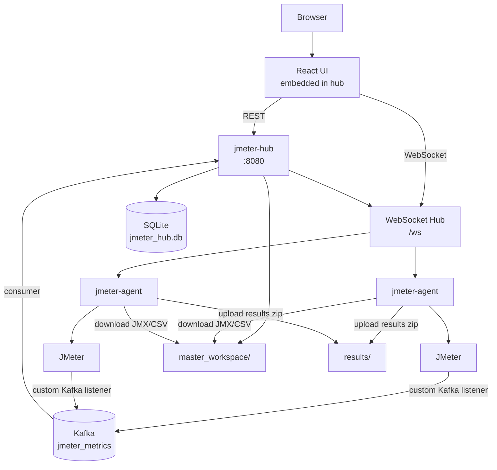
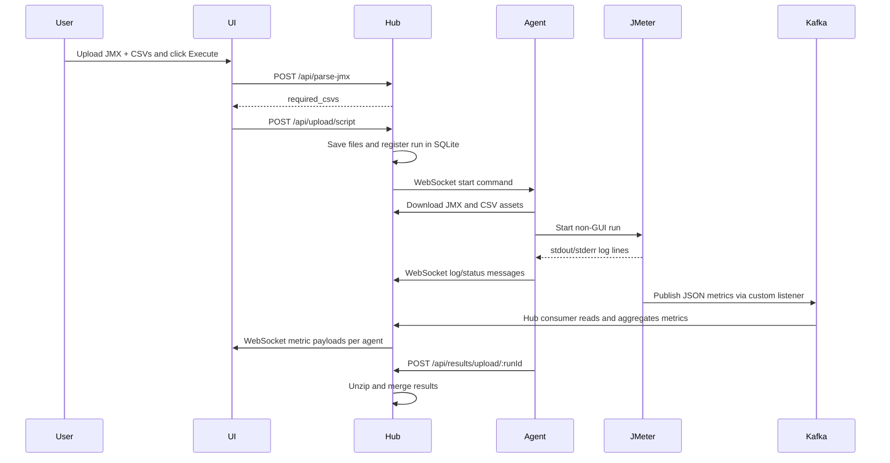

# JMeter UI Executor

Distributed JMeter execution with a Go hub, Go agents, embedded React UI, SQLite run history, and Kafka-backed live metrics.

## What It Does

- The hub serves the UI, stores run history, dispatches test commands, and merges results.
- Agents connect over WebSocket, download the JMX and CSV assets they need, run JMeter, stream logs, and upload zipped results.
- Live metrics come from a Kafka topic consumed by the hub.
- The JMX script is now the source of truth for BackendListener configuration. The agent does not inject an Influx listener anymore.

## Current Metrics Model

- The hub consumes Kafka from `localhost:29092` on topic `jmeter_metrics`.
- The agent passes `-JagentId=<agent-id>` to JMeter.
- Your JMX must already contain the custom Kafka BackendListener and should use the `agentId` JMeter property when populating `agent_id`.
- The hub aggregates metrics every second and broadcasts per-agent payloads to the UI in this shape:

```json
{
   "type": "metric",
   "data": {
      "requests": 12,
      "errors": 1,
      "threads": 50,
      "agent_id": "agent-1"
   }
}
```

## Architecture




## Quick Start

### Prerequisites

- Go installed and available on `PATH`
- Node.js and npm installed
- Apache JMeter installed
- Kafka reachable at `localhost:29092`
- A JMX script that already includes your custom Kafka BackendListener

If `jmeter` is not on `PATH`, set `JMETER_HOME`:

```bash
export JMETER_HOME=/path/to/apache-jmeter
export PATH="$JMETER_HOME/bin:$PATH"
```

### 1. Build the UI

```bash
cd jmeter-hub/ui
npm install
npm run build
```

This generates `jmeter-hub/ui/dist`, which is embedded into the hub binary at build time.

### 2. Build and run the hub

```bash
cd jmeter-hub
go build -o jmeter-hub
./jmeter-hub
```

Default runtime details:

- Hub HTTP port: `8080`
- Kafka brokers: `localhost:29092`
- Kafka topic: `jmeter_metrics`
- SQLite database: `./jmeter_hub.db`

### 3. Build and run one or more agents

```bash
cd jmeter-agent
go build -o jmeter-agent
./jmeter-agent -hub="ws://localhost:8080/ws" -id="agent-1"
```

Start additional agents in separate terminals with different `-id` values.

### 4. Open the UI and run a test

1. Open `http://localhost:8080`
2. Upload a `.jmx` script
3. Upload any required CSV files
4. Choose single or distributed execution
5. Select the connected agents
6. Start the run
7. Watch logs and Kafka-backed live metrics in the UI

## Example JMX Expectations

Your JMX should already include the custom Kafka BackendListener, for example:

- `classname = com.example.java.KafkaBackendListenerClient`
- `kafka.bootstrap.servers = localhost:29092`
- `kafka.topic = jmeter_metrics`
- `agent.id = ${__P(agentId)}`

The agent keeps passing `-JagentId=<agent-id>` automatically, so the listener can tag emitted metrics per agent.

## Test Execution Flow



## Important Behavior Changes

- The agent no longer injects an InfluxDB BackendListener.
- The `InjectBackendListener` function remains in the codebase as a no-op compatibility hook.
- The hub no longer exposes or uses `/api/v2/write` for metrics.
- If a JMX script does not include your Kafka BackendListener, the test can still run, but live metrics will be absent.

## Main Components

### `jmeter-hub`

- Serves the embedded UI and REST API
- Hosts the `/ws` WebSocket endpoint for agents and the UI
- Consumes Kafka metrics and forwards aggregated per-agent payloads to the UI
- Stores test runs in SQLite
- Merges agent result archives after completion

Key files:

- `jmeter-hub/main.go`
- `jmeter-hub/api/api.go`
- `jmeter-hub/net/hub.go`
- `jmeter-hub/services/kafka.consumer.go`
- `jmeter-hub/database/database.go`

### `jmeter-agent`

- Connects to the hub over WebSocket
- Downloads the JMX and CSV assets for a run
- Starts JMeter in non-GUI mode
- Streams logs and status back to the hub
- Uploads zipped results to the hub

Key files:

- `jmeter-agent/main.go`
- `jmeter-agent/network/client.go`
- `jmeter-agent/executor/executor.go`
- `jmeter-agent/workspace/workspace.go`
- `jmeter-agent/cleanup/cleanup.go`
- `jmeter-agent/xmlparser/injector.go`

### `jmeter-hub/ui`

- Vite + React + TypeScript frontend
- Receives logs and metric payloads over WebSocket
- Displays per-run logs, live metrics, execution controls, and history

Key files:

- `jmeter-hub/ui/src/hooks/useAgentSocket.ts`
- `jmeter-hub/ui/src/components/TestRunner.tsx`
- `jmeter-hub/ui/src/components/LiveMetrics.tsx`
- `jmeter-hub/ui/src/components/LiveTerminal.tsx`
- `jmeter-hub/ui/src/components/HistoryTable.tsx`

## Convenience Scripts

- `test-2-agents-hub.sh`: starts the hub and optionally two agents using existing binaries
- `kill-hub-and-agents.sh`: stops locally running hub and agent processes

If you use `test-2-agents-hub.sh`, build the binaries first.

## Troubleshooting

### Hub build fails with missing embedded UI files

Run:

```bash
cd jmeter-hub/ui
npm install
npm run build
```

Then rebuild the hub.

### No live metrics in the UI

Check these first:

- Kafka is running on `localhost:29092`
- The JMX contains your custom Kafka BackendListener
- The listener publishes to `jmeter_metrics`
- The listener sets `agent_id` from `${__P(agentId)}` or equivalent

### Agent starts but JMeter fails

Check:

- `jmeter` is on `PATH`, or `JMETER_HOME` is set correctly
- The downloaded CSV file paths resolve correctly on the agent
- Any custom JMeter plugin JAR needed by the Kafka listener is installed in JMeter's `lib/ext`

## Current Limitations

- Kafka broker and topic are hard-coded today in the hub startup path.
- The platform assumes your JMX already contains the correct Kafka listener and supporting plugin.
- Historical generated run artifacts in the repository may still contain older Influx-based JMX snapshots; those are not used by the current source code.
