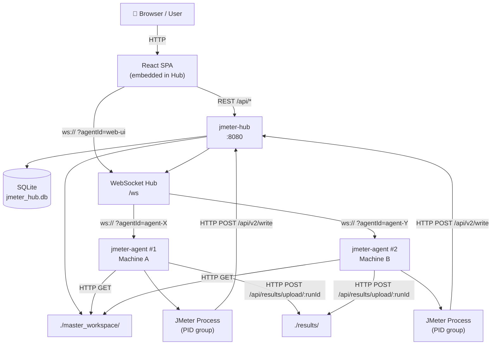
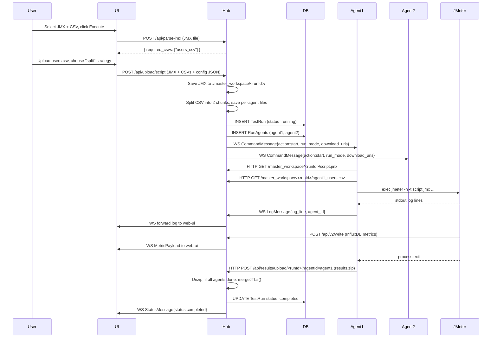

# JMeter UI Executor — Platform Documentation

## Table of Contents
1. [High-Level Overview](#1-high-level-overview)
2. [Architecture Diagram](#2-architecture-diagram)
3. [Request Flow — Starting a Test](#3-request-flow--starting-a-test)
4. [Service: `jmeter-hub`](#4-service-jmeter-hub)
   - [main.go](#41-maingo)
   - [api/api.go](#42-apiapiго)
   - [net/hub.go](#43-nethubgo)
   - [net/websocket.go](#44-netwebsocketgo)
   - [database/database.go](#45-databasedatabasego)
   - [parser/jmx_parser.go](#46-parserjmx_parsergo)
   - [parser/csv_splitter.go](#47-parsercsv_splittergo)
   - [models/command.go](#48-modelscommandgo)
5. [Service: `jmeter-agent`](#5-service-jmeter-agent)
   - [main.go](#51-maingo-1)
   - [models/messages.go](#52-modelsmessagesgo)
   - [network/client.go](#53-networkclientgo)
   - [executor/executor.go](#54-executorexecutorgo)
   - [cleanup/cleanup.go](#55-cleanupcleanuрgo)
   - [workspace/workspace.go](#56-workspaceworkspacego)
   - [xmlparser/injector.go](#57-xmlparserinjectorgo)
6. [UI: `jmeter-hub/ui`](#6-ui-jmeter-hubui)
   - [main.tsx](#61-maintsx)
   - [App.tsx](#62-apptsx)
   - [layouts/DashboardLayout.tsx](#63-layoutsdashboardlayouttsx)
   - [services/api.ts](#64-servicesapits)
   - [hooks/useAgentSocket.ts](#65-hooksuseagentsocketts)
   - [components/TestRunner.tsx](#66-componentstestrunnertsx)
   - [components/LiveTerminal.tsx](#67-componentsliveterminaltsx)
   - [components/LiveMetrics.tsx](#68-componentslivemetricstsx)
   - [components/HistoryTable.tsx](#69-componentshistorytabletsx)

---

## 1. High-Level Overview

The platform is a **self-hosted distributed JMeter orchestration system**. It replaces the manual process of SSHing into machines, running JMeter by hand, and collecting results manually.

It consists of **two independent Go binaries**:

| Component | Binary | Role |
|---|---|---|
| **Hub** | [jmeter-hub](file:///home/yedhubabu/SelfProjects/T/jmeter-hub/jmeter-hub) | Central coordinator: serves UI, dispatches commands to agents, stores run history, receives/merges results |
| **Agent** | [jmeter-agent](file:///home/yedhubabu/SelfProjects/T/jmeter-agent/jmeter-agent) | Runs on each load-generating machine: receives commands, executes JMeter, streams logs, uploads results |

**Communication paths:**
- UI ↔ Hub: HTTP REST + WebSocket
- Hub ↔ Agent: WebSocket (persistent, bidirectional)
- Agent → Hub: HTTP POST (result zip upload)
- Agent → Hub: WebSocket (log lines + status messages)
- JMeter → Hub: HTTP POST (InfluxDB line protocol for live metrics)

---

## 2. Architecture Diagram



---

## 3. Request Flow — Starting a Test



---

## 4. Service: [jmeter-hub](file:///home/yedhubabu/SelfProjects/T/jmeter-hub/jmeter-hub)

### 4.1 [main.go](file:///home/yedhubabu/SelfProjects/T/jmeter-hub/main.go)

Entry point for the Hub binary.

| Step | What It Does |
|---|---|
| **1. Logging** | Initialises structured JSON logging via `slog` to stdout |
| **2. Database** | Calls `database.InitializeDB("./jmeter_hub.db")` to open SQLite and create tables |
| **3. Zombie reset** | Calls `database.ResetZombieRuns()` — marks any runs that were `running` when the Hub last crashed as `failed`, and does the same for their `RunAgents` rows |
| **4. Hub** | Instantiates `net.NewHub()` and launches it in a goroutine via `wsHub.Run()` |
| **5. Router** | Calls `api.SetupRouter(wsHub)` to register all HTTP routes and WebSocket endpoint |
| **6. Static UI** | Serves the embedded React SPA via `fs.Sub` on the `//go:embed ui/dist/*` filesystem |
| **7. MIME detection** | Uses `mime.TypeByExtension(filepath.Ext(path))` instead of a hardcoded if/else chain for correct Content-Type headers |
| **8. SPA fallback** | `router.NoRoute` serves `index.html` for any unknown path so React Router handles client-side navigation |
| **9. Listen** | `router.Run(":8080")` — blocks until the server dies |

---

### 4.2 [api/api.go](file:///home/yedhubabu/SelfProjects/T/jmeter-hub/api/api.go)

All HTTP handler functions. Mounted under `/api` via [SetupRouter](file:///home/yedhubabu/SelfProjects/T/jmeter-hub/api/api.go#24-65).

#### [SetupRouter(hub *net.Hub) *gin.Engine](file:///home/yedhubabu/SelfProjects/T/jmeter-hub/api/api.go#24-65)
Registers all routes and returns the configured Gin engine:
- Creates `./master_workspace/` and `./results/` directories on startup
- Mounts all `/api/*` routes
- Serves `./results/` as static HTML at `/reports/*` (JMeter HTML reports)
- Serves `./master_workspace/` as static files at `/master_workspace/*` (for agents to download JMX/CSV)
- Mounts WebSocket handler at `GET /ws`

#### [UploadScriptHandler(hub *net.Hub) gin.HandlerFunc](file:///home/yedhubabu/SelfProjects/T/jmeter-hub/api/api.go#66-247)
The primary test-launch endpoint. Called by the UI when the user clicks Execute.

1. Parses the 32MB multipart form
2. Reads the `config` JSON field: `{ mode, agents[], csvStrategies{}, hasCsvHeader }`
3. Saves the uploaded `.jmx` to `./master_workspace/<runId>/script.jmx`
4. Calls `parser.ParseRequiredCSVs()` to find CSV variable names in the JMX
5. For each required CSV:
   - If `mode=distributed` and `strategy=split`: calls `parser.SplitCSV()` then saves per-agent chunks
   - Otherwise (`share` or `single`): saves one copy and gives all agents the same download URL
6. Writes a [TestRun](file:///home/yedhubabu/SelfProjects/T/jmeter-hub/ui/src/services/api.ts#3-11) row and per-agent `RunAgents` rows to SQLite
7. For each agent, marshals a `models.CommandMessage{action:start, run_id, run_mode, download_urls}` and sends it via `hub.SendCommand()`
8. Returns `{ message, runId }` to the UI

#### [ParseJMXHandler(c *gin.Context)](file:///home/yedhubabu/SelfProjects/T/jmeter-hub/api/api.go#248-285)
Called by the UI immediately after a JMX file is selected (before running).

1. Saves the uploaded JMX to a temp file under `./master_workspace/temp/`
2. Calls `parser.ParseRequiredCSVs()` on it
3. Defers `os.Remove` of the temp file
4. Returns `{ required_csvs: ["var1", "var2"] }` so the UI knows which CSV files to ask the user for

#### [ResultReceiverHandler(c *gin.Context)](file:///home/yedhubabu/SelfProjects/T/jmeter-hub/api/api.go#286-353)
Called by [jmeter-agent](file:///home/yedhubabu/SelfProjects/T/jmeter-agent/jmeter-agent) via HTTP POST after JMeter finishes.

1. Reads `runId` path param and `agentId` query param
2. Saves the uploaded `.zip` to `./results/<runId>/<agentId>/results.zip`
3. Calls [unzip()](file:///home/yedhubabu/SelfProjects/T/jmeter-hub/api/api.go#396-445) to extract it in-place
4. Deletes the zip file to save disk space
5. Updates the agent row in `RunAgents` to `completed` with the result dir path
6. Checks `database.AreAllAgentsZipped(runID)` — if all agents have uploaded:
   - Calls [mergeJTLs()](file:///home/yedhubabu/SelfProjects/T/jmeter-hub/api/api.go#446-504) to combine all `results.jtl` files into one
   - Updates `TestRuns` row to `completed`

#### [GetActiveRunHandler(c *gin.Context)](file:///home/yedhubabu/SelfProjects/T/jmeter-hub/api/api.go#354-375)
Polled by the UI on page load to recover a running test after a browser refresh.

- Calls `database.GetActiveRun()`
- Returns `{ active: true, runId: "run-..." }` or `{ active: false, runId: null }`

#### [GetHistoryHandler(c *gin.Context)](file:///home/yedhubabu/SelfProjects/T/jmeter-hub/api/api.go#376-395)
Returns the last 100 test runs from SQLite ordered by `StartTime DESC`.

#### `InfluxMetricsReceiver(hub *net.Hub) gin.HandlerFunc`
Accepts live metrics from JMeter's InfluxDB BackendListener (line protocol format).

- Mounted at both `/api/v2/write/:runId` and `/api/v2/write` (fallback)
- Reads the raw body (InfluxDB line protocol text)
- Wraps it in a `{ type: "metric", data: "<raw>" }` JSON payload
- Broadcasts it to `web-ui` over WebSocket so the LiveMetrics component can parse it

#### [unzip(src, dest string) error](file:///home/yedhubabu/SelfProjects/T/jmeter-hub/api/api.go#396-445)
Private helper. Safely extracts a zip file:
- Guards against **ZipSlip** (path traversal attacks) by verifying each extracted path has `dest` as a prefix
- Handles both directories and files
- Limits each file to 500MB via `io.LimitReader` to prevent decompression bombs

#### [mergeJTLs(runID, destPath string) error](file:///home/yedhubabu/SelfProjects/T/jmeter-hub/api/api.go#446-504)
Combines per-agent `results.jtl` files into a single master JTL:
- Reads `./results/<runID>/` directory for agent subdirs
- Opens each `<agentDir>/results.jtl`
- Writes the CSV header line from the first file only; skips header for subsequent files
- Appends all data rows to the output file at `destPath`
- Checks `WriteString` errors so silent disk-full failures are surfaced

---

### 4.3 [net/hub.go](file:///home/yedhubabu/SelfProjects/T/jmeter-hub/net/hub.go)

The WebSocket message router. Runs as a single goroutine ([Run()](file:///home/yedhubabu/SelfProjects/T/jmeter-hub/net/hub.go#52-157)) that owns the `Clients` map exclusively, with a `sync.RWMutex` for safe read-access from HTTP goroutines.

#### [Hub](file:///home/yedhubabu/SelfProjects/T/jmeter-hub/net/hub.go#20-40) struct fields
| Field | Type | Purpose |
|---|---|---|
| `Clients` | `map[string]*Client` | All connected WebSocket clients keyed by agent ID |
| `Broadcast` | `chan []byte` | Inbound messages from any client (agents or UI) |
| [Register](file:///home/yedhubabu/SelfProjects/T/jmeter-hub/database/database.go#142-161) | `chan *Client` | New connection registration requests |
| `Unregister` | `chan *Client` | Disconnection notifications |
| `DirectSend` | `chan DirectMessage` | Targeted sends from HTTP handlers (safe alternative to direct map access) |
| `clientsMu` | `sync.RWMutex` | Protects `Clients` for reads from outside [Run()](file:///home/yedhubabu/SelfProjects/T/jmeter-hub/net/hub.go#52-157) |

#### [NewHub() *Hub](file:///home/yedhubabu/SelfProjects/T/jmeter-hub/net/hub.go#41-51)
Allocates and returns an initialized Hub with buffered `DirectSend` channel (size 32).

#### [Run()](file:///home/yedhubabu/SelfProjects/T/jmeter-hub/net/hub.go#52-157)
The event loop goroutine. Processes four channel cases:
- **[Register](file:///home/yedhubabu/SelfProjects/T/jmeter-hub/database/database.go#142-161)**: Acquires write lock, adds client to `Clients` map
- **`Unregister`**: Acquires write lock, removes client if it matches the current connection (prevents stale-reconnect bugs), closes the client's [Send](file:///home/yedhubabu/SelfProjects/T/jmeter-agent/network/client.go#241-244) channel
- **`DirectSend`**: Receives a [DirectMessage](file:///home/yedhubabu/SelfProjects/T/jmeter-hub/net/hub.go#14-18), acquires read lock to find the target client, sends the payload. Falls back to removing the client if its [Send](file:///home/yedhubabu/SelfProjects/T/jmeter-agent/network/client.go#241-244) channel is full
- **`Broadcast`**: Unmarshals the JSON payload and routes based on content:
  - `status != ""` → DB update + forward to UI. Marks run as `completed` if all agents finished
  - `targetAgentId != ""` → Forward to that specific agent (stop commands from UI)
  - `log_line != ""` → Forward to `web-ui` only
  - else → broadcast to all clients (fallback)

#### [sendToUI(message []byte)](file:///home/yedhubabu/SelfProjects/T/jmeter-hub/net/hub.go#158-175)
Private helper. Looks up the `"web-ui"` client under `RLock` and sends the message. Removes and closes the client if its send buffer is full.

#### [broadcastAll(message []byte)](file:///home/yedhubabu/SelfProjects/T/jmeter-hub/net/hub.go#176-196)
Private helper. Copies the clients map snapshot under `RLock`, then sends to each client, cleaning up any that are full.

#### [SendCommand(agentID string, message []byte) error](file:///home/yedhubabu/SelfProjects/T/jmeter-hub/net/hub.go#197-204)
Called from HTTP handler goroutines (NOT from [Run()](file:///home/yedhubabu/SelfProjects/T/jmeter-hub/net/hub.go#52-157)). Sends a [DirectMessage](file:///home/yedhubabu/SelfProjects/T/jmeter-hub/net/hub.go#14-18) to the `DirectSend` channel so [Run()](file:///home/yedhubabu/SelfProjects/T/jmeter-hub/net/hub.go#52-157) can route it safely without a map race.

#### [GetAgentIDs() []string](file:///home/yedhubabu/SelfProjects/T/jmeter-hub/net/hub.go#205-218)
Called from the `/api/agents` HTTP handler. Acquires `RLock`, returns a snapshot slice of all non-`"web-ui"` client IDs. Safe to call from any goroutine.

---

### 4.4 [net/websocket.go](file:///home/yedhubabu/SelfProjects/T/jmeter-hub/net/websocket.go)

Handles the WebSocket upgrade and per-connection pump goroutines.

#### `upgrader` (package var)
A `websocket.Upgrader` that accepts any origin (CORS-open; suitable for local/LAN use). Buffer sizes: 1024 bytes each for read and write.

#### [Client](file:///home/yedhubabu/SelfProjects/T/jmeter-hub/net/websocket.go#20-26) struct
Represents one active WebSocket connection:
- [Hub](file:///home/yedhubabu/SelfProjects/T/jmeter-hub/net/hub.go#20-40): pointer back to the Hub for registration/broadcast
- [AgentID](file:///home/yedhubabu/SelfProjects/T/jmeter-hub/net/hub.go#205-218): the `?agentId=` query param value from the connection URL
- [Conn](file:///home/yedhubabu/SelfProjects/T/jmeter-agent/network/client.go#36-57): the underlying `*websocket.Conn`
- [Send](file:///home/yedhubabu/SelfProjects/T/jmeter-agent/network/client.go#241-244): a `chan []byte` (buffer 256) — messages queued here are written to the socket

#### [readPump()](file:///home/yedhubabu/SelfProjects/T/jmeter-hub/net/websocket.go#27-49)
Runs in a goroutine per connection. Reads incoming messages from the WebSocket and sends them to `hub.Broadcast`. Sets a 10MB read limit per message via `SetReadLimit`. On error or close, triggers `Unregister`.

#### [writePump()](file:///home/yedhubabu/SelfProjects/T/jmeter-hub/net/websocket.go#50-81)
Runs in a goroutine per connection. Reads from `c.Send` and writes to the WebSocket. Also sends a WebSocket **ping** every 54 seconds to keep the connection alive through proxies/firewalls. On channel close or write error, sends a `CloseMessage` and exits.

#### [ServeWs(hub *Hub, w http.ResponseWriter, r *http.Request)](file:///home/yedhubabu/SelfProjects/T/jmeter-hub/net/websocket.go#82-111)
The HTTP handler at `GET /ws`. Upgrades the connection, reads `?agentId=` from the query string (rejects connections without it), creates a [Client](file:///home/yedhubabu/SelfProjects/T/jmeter-hub/net/websocket.go#20-26), registers it with the Hub, and launches [writePump](file:///home/yedhubabu/SelfProjects/T/jmeter-hub/net/websocket.go#50-81) and [readPump](file:///home/yedhubabu/SelfProjects/T/jmeter-hub/net/websocket.go#27-49) goroutines.

---

### 4.5 [database/database.go](file:///home/yedhubabu/SelfProjects/T/jmeter-hub/database/database.go)

All SQLite persistence logic. Uses `database/sql` with the `mattn/go-sqlite3` driver.

#### Schema
| Table | Key Columns | Purpose |
|---|---|---|
| `TestRuns` | `ID, ScriptName, Status, StartTime, EndTime, LogPath` | One row per test run |
| `RunAgents` | `RunID, AgentID, Status, ZipPath` | One row per agent per run |
| [Agents](file:///home/yedhubabu/SelfProjects/T/jmeter-hub/ui/src/services/api.ts#62-70) | `ID, IPAddress, Status, LastSeen` | Agent registry (created but not actively used) |

#### [InitializeDB(dbPath string) error](file:///home/yedhubabu/SelfProjects/T/jmeter-hub/database/database.go#32-64)
Opens the SQLite file, pings it, sets `MaxOpenConns(1)` (SQLite is single-writer), enables WAL journal mode for read concurrency, then calls [createTables()](file:///home/yedhubabu/SelfProjects/T/jmeter-hub/database/database.go#65-111).

#### [createTables() error](file:///home/yedhubabu/SelfProjects/T/jmeter-hub/database/database.go#65-111)
Executes `CREATE TABLE IF NOT EXISTS` for all three tables. Returns the first error encountered.

#### [InsertRun(run TestRun) error](file:///home/yedhubabu/SelfProjects/T/jmeter-hub/database/database.go#112-124)
Inserts a new [TestRun](file:///home/yedhubabu/SelfProjects/T/jmeter-hub/ui/src/services/api.ts#3-11) row. Called at test launch.

#### [UpdateRunStatus(id, status string, endTime *time.Time, logPath *string) error](file:///home/yedhubabu/SelfProjects/T/jmeter-hub/database/database.go#125-141)
Updates [Status](file:///home/yedhubabu/SelfProjects/T/jmeter-agent/network/client.go#245-248), `EndTime`, and `LogPath` for a run. Logs a warning if 0 rows are affected (run ID not found).

#### [AddRunAgent(runID, agentID, status string) error](file:///home/yedhubabu/SelfProjects/T/jmeter-hub/database/database.go#162-172)
Inserts a `RunAgents` row for one agent participating in a run.

#### [UpdateRunAgentStatus(runID, agentID, status string, zipPath *string) error](file:///home/yedhubabu/SelfProjects/T/jmeter-hub/database/database.go#173-183)
Updates an individual agent's status and zip result path.

#### [AreAllAgentsFinished(runID string) bool](file:///home/yedhubabu/SelfProjects/T/jmeter-hub/database/database.go#184-195)
Counts `RunAgents` rows for a run that are NOT `completed` or `failed`. Returns `true` if count = 0.

#### [AreAllAgentsZipped(runID string) bool](file:///home/yedhubabu/SelfProjects/T/jmeter-hub/database/database.go#196-210)
Counts `RunAgents` rows that are `completed` but have a `NULL` `ZipPath`. Returns `true` if count = 0 (all completed agents have uploaded their zip).

#### [GetHistory(limit int) ([]TestRun, error)](file:///home/yedhubabu/SelfProjects/T/jmeter-hub/database/database.go#211-248)
SELECT from `TestRuns` ordered by `StartTime DESC` with a row limit. Checks `rows.Err()` after scanning.

#### [GetActiveRun() (*TestRun, error)](file:///home/yedhubabu/SelfProjects/T/jmeter-hub/database/database.go#249-274)
SELECT the first [TestRun](file:///home/yedhubabu/SelfProjects/T/jmeter-hub/ui/src/services/api.ts#3-11) with `Status = 'running'`. Returns `nil, nil` if none found.

#### [RegisterAgent(agent Agent) error](file:///home/yedhubabu/SelfProjects/T/jmeter-hub/database/database.go#142-161)
Upserts an [Agents](file:///home/yedhubabu/SelfProjects/T/jmeter-hub/ui/src/services/api.ts#62-70) row using SQLite's `ON CONFLICT ... DO UPDATE` syntax. Not currently called from anywhere active.

#### [ResetZombieRuns() error](file:///home/yedhubabu/SelfProjects/T/jmeter-hub/database/database.go#275-303)
Runs on Hub startup. Two-step:
1. `UPDATE TestRuns SET Status='failed' WHERE Status='running'`
2. `UPDATE RunAgents SET Status='failed' WHERE Status='running' AND RunID IN (SELECT ...)` — ensures [AreAllAgentsFinished](file:///home/yedhubabu/SelfProjects/T/jmeter-hub/database/database.go#184-195) returns correct results for zombie runs.

---

### 4.6 [parser/jmx_parser.go](file:///home/yedhubabu/SelfProjects/T/jmeter-hub/parser/jmx_parser.go)

#### Package-level regex vars
```go
csvDataSetRegex    // matches <CSVDataSet>...</CSVDataSet> blocks
filenamePropRegex  // extracts ${__P(VARIABLE_NAME)} from filename props
```
Compiled once at package init, not on every call.

#### [ParseRequiredCSVs(jmxFilePath string) ([]string, error)](file:///home/yedhubabu/SelfProjects/T/jmeter-hub/parser/jmx_parser.go#18-48)
1. Reads the entire JMX file into memory
2. Finds all `<CSVDataSet>` blocks using `csvDataSetRegex`
3. Within each block, extracts variable names from `<stringProp name="filename">${__P(VAR)}</stringProp>` using `filenamePropRegex`
4. Deduplicates variable names (a variable used in multiple CSVDataSets is returned once)
5. Returns the list of variable names (e.g. `["users_csv", "products_csv"]`)

These variable names become the CSV upload keys in the multipart form.

---

### 4.7 [parser/csv_splitter.go](file:///home/yedhubabu/SelfProjects/T/jmeter-hub/parser/csv_splitter.go)

#### [SplitCSV(filePath string, numChunks int, hasHeader bool) ([][][]string, error)](file:///home/yedhubabu/SelfProjects/T/jmeter-hub/parser/csv_splitter.go#9-86)
Splits a CSV file into `numChunks` equal parts for distributed agent execution.

1. Validates `numChunks > 0`
2. Reads the entire file with `encoding/csv`
3. If `hasHeader=true`: separates the first row as the header; it will be prepended to every chunk
4. Divides data rows using remainder-distributing round-robin (earlier chunks get one extra row when rows don't divide evenly)
5. Prepends the header row to each chunk if `hasHeader=true`
6. Returns a `[][][]string` — slice of chunks, each chunk is a `[][]string` (rows of fields)

**Example with 5 data rows, 2 chunks:** Chunk 1 = 3 rows, Chunk 2 = 2 rows.

#### [SaveCSVChunk(chunk [][]string, destPath string) error](file:///home/yedhubabu/SelfProjects/T/jmeter-hub/parser/csv_splitter.go#87-111)
Writes a `[][]string` chunk back to a CSV file on disk using `encoding/csv`. Calls `writer.Flush()` explicitly and checks `writer.Error()` so flush failures surface as errors rather than being silently dropped.

---

### 4.8 [models/command.go](file:///home/yedhubabu/SelfProjects/T/jmeter-hub/models/command.go)

Defines the typed payload used by the Hub when dispatching commands to agents.

#### [CommandAction](file:///home/yedhubabu/SelfProjects/T/jmeter-agent/models/messages.go#6-7) (string type)
Constants: `ActionStart = "start"`, `ActionStop = "stop"`, `ActionPing = "ping"`

#### [CommandMessage](file:///home/yedhubabu/SelfProjects/T/jmeter-agent/models/messages.go#28-35) struct
```go
Action       CommandAction     json:"action"
RunID        string            json:"run_id"
RunMode      string            json:"run_mode"       // "single" or "distributed"
DownloadURLs map[string]string json:"download_urls"  // {"jmx": "...", "users_csv": "..."}
JmeterParams map[string]string json:"jmeter_params"  // reserved for future -J overrides
```
Serialised to JSON and sent as a WebSocket message to each agent.

---

## 5. Service: [jmeter-agent](file:///home/yedhubabu/SelfProjects/T/jmeter-agent/jmeter-agent)

### 5.1 [main.go](file:///home/yedhubabu/SelfProjects/T/jmeter-hub/main.go)

Entry point for the Agent binary.

1. **Logging**: Structured JSON via `slog`
2. **Flags**: `-id` (agent ID, defaults to hostname + 2-byte random hex) and [-hub](file:///home/yedhubabu/SelfProjects/T/jmeter-hub/jmeter-hub) (WebSocket URL, default `ws://localhost:8080/ws`)
3. **Agent ID**: If not provided, generates `hostname-<4-hex-chars>` so multiple agents on the same machine get unique IDs
4. **URL construction**: Appends `?agentId=<id>` to the Hub URL if not already present
5. **Connect**: Calls `client.Connect()` with exponential backoff (up to 10 retries)
6. **Listen**: Launches `client.Listen()` in a goroutine — the main command receive loop
7. **Shutdown**: Waits for `SIGINT`/`SIGTERM`, then calls `client.Close()`

---

### 5.2 [models/messages.go](file:///home/yedhubabu/SelfProjects/T/jmeter-agent/models/messages.go)

Defines all message types exchanged between Hub and Agent.

#### [CommandMessage](file:///home/yedhubabu/SelfProjects/T/jmeter-agent/models/messages.go#28-35) (inbound from Hub)
```go
Action       CommandAction     // "start", "stop", "ping"
RunID        string
RunMode      string            // "single" or "distributed"
DownloadURLs DownloadURLs      // map[string]string
JmeterParams map[string]string // -J params for JMeter CLI
```

#### [StatusMessage](file:///home/yedhubabu/SelfProjects/T/jmeter-agent/models/messages.go#37-43) (outbound to Hub)
```go
RunID, AgentID, Status, Message
```
Status constants: `StatusRunning`, `StatusStopped`, `StatusFailed`, `StatusCompleted`

#### [LogMessage](file:///home/yedhubabu/SelfProjects/T/jmeter-agent/models/messages.go#45-51) (outbound to Hub)
```go
RunID, AgentID, LogLine, Timestamp
```
Sent for every non-empty line from JMeter's stdout/stderr.

---

### 5.3 [network/client.go](file:///home/yedhubabu/SelfProjects/T/jmeter-agent/network/client.go)

The agent's connection manager. Handles connecting to the Hub, receiving commands, and sending messages back.

#### [Client](file:///home/yedhubabu/SelfProjects/T/jmeter-hub/net/websocket.go#20-26) struct
```go
hubURL  string           // full WebSocket URL including ?agentId=
agentID string
conn    *websocket.Conn  // nil when disconnected
mu      sync.Mutex       // guards conn
done    chan struct{}     // closed by Close() to signal Listen() to exit
```

#### [NewClient(hubURL, agentID string) *Client](file:///home/yedhubabu/SelfProjects/T/jmeter-agent/network/client.go#28-35)
Constructor. Allocates the `done` channel.

#### [Connect() error](file:///home/yedhubabu/SelfProjects/T/jmeter-agent/network/client.go#36-57)
Attempts to dial the Hub WebSocket with **exponential backoff** (base 1s, doubles each attempt, up to 10 retries). Stores the connection under mutex. Returns the last error if all retries fail.

#### [Listen()](file:///home/yedhubabu/SelfProjects/T/jmeter-agent/network/client.go#58-116)
The main receive loop. Runs until `c.done` is closed.
1. At the top of each iteration: selects on `done` — exits if [Close()](file:///home/yedhubabu/SelfProjects/T/jmeter-agent/network/client.go#258-271) was called
2. If `conn == nil`: attempts [Connect()](file:///home/yedhubabu/SelfProjects/T/jmeter-agent/network/client.go#36-57), sleeps 5s on failure
3. Reads a message from the WebSocket under the copied `conn` reference
4. On read error: sets `c.conn = nil` to trigger reconnect on next iteration
5. Unmarshals the JSON as a `models.CommandMessage`
6. Dispatches based on [Action](file:///home/yedhubabu/SelfProjects/T/jmeter-agent/models/messages.go#6-7): `"start"` → `go c.startTest()`, `"stop"` → `go c.stopTest()`, `"ping"` → no-op, unknown non-empty → warning log

#### [startTest(cmd *models.CommandMessage)](file:///home/yedhubabu/SelfProjects/T/jmeter-agent/network/client.go#117-232)
Runs in a goroutine. Full test setup and launch sequence:

1. Creates an isolated run directory via `workspace.CreateRunDirectory(runID, agentID)`
2. Downloads the JMX file from `cmd.DownloadURLs["jmx"]`
3. Downloads each additional CSV/asset file, computing their absolute paths and injecting them into `cmd.JmeterParams` — `filepath.Abs` error now causes an early failure instead of passing a blank path
4. Calls `xmlparser.InjectBackendListener(jmxPath)` to auto-add InfluxDB metrics if missing from the JMX
5. Constructs the result upload URL from `c.hubURL` using `net/url` parsing (handles both `ws://` and `wss://`)
6. Builds `onLog` and [onStatus](file:///home/yedhubabu/SelfProjects/T/jmeter-hub/ui/src/hooks/useAgentSocket.ts#3-4) callbacks that wrap `c.SendLog()` and `c.SendStatus()`
7. Calls `executor.Execute(...)` — returns immediately if JMeter started successfully; the goroutine inside [Execute](file:///home/yedhubabu/SelfProjects/T/jmeter-agent/executor/executor.go#29-216) handles the async completion

#### [stopTest(cmd *models.CommandMessage)](file:///home/yedhubabu/SelfProjects/T/jmeter-agent/network/client.go#233-240)
Calls `executor.StopTest(cmd.RunID)` to terminate the JMeter process group.

#### [SendLog(logMsg LogMessage) error](file:///home/yedhubabu/SelfProjects/T/jmeter-agent/network/client.go#241-244) / [SendStatus(statusMsg StatusMessage) error](file:///home/yedhubabu/SelfProjects/T/jmeter-agent/network/client.go#245-248)
Public helpers that call [sendJSON](file:///home/yedhubabu/SelfProjects/T/jmeter-agent/network/client.go#249-257).

#### [sendJSON(v interface{}) error](file:///home/yedhubabu/SelfProjects/T/jmeter-agent/network/client.go#249-257)
Acquires the mutex, checks `conn != nil`, then calls `conn.WriteJSON(v)`. Thread-safe write to the WebSocket.

#### [Close()](file:///home/yedhubabu/SelfProjects/T/jmeter-agent/network/client.go#258-271)
Acquires mutex, closes the `conn`, sets it to `nil`. Closes the `done` channel exactly once (guarded by `select`).

---

### 5.4 [executor/executor.go](file:///home/yedhubabu/SelfProjects/T/jmeter-agent/executor/executor.go)

Manages JMeter process lifecycle.

#### Package-level state
```go
runningCmds   map[string]*exec.Cmd  // runID → active process
runningCmdsMu sync.Mutex
```

#### [Execute(runID, agentID, jmxPath, runMode string, jmeterParams map[string]string, uploadURL string, onLog LogCallback, onStatus StatusCallback) error](file:///home/yedhubabu/SelfProjects/T/jmeter-agent/executor/executor.go#29-216)
Prepares and launches JMeter asynchronously.

1. Resolves absolute paths for the JMX, JTL output, and log files
2. Constructs the InfluxDB metrics URL by rewriting the upload URL path to `/api/v2/write?db=jmeter`
3. Builds the JMeter CLI args: `-n` (non-GUI), `-t <jmx>`, `-l <results.jtl>`, `-j <jmeter.log>`
4. Appends all `jmeterParams` as `-J<key>=<value>` args
5. Auto-injects InfluxDB connection args (`-JinfluxdbUrl`, `-Japplication`) if not already in params
6. Resolves the `jmeter` executable from PATH or `$JMETER_HOME/bin/jmeter`
7. Sets `cmd.SysProcAttr = &syscall.SysProcAttr{Setpgid: true}` — puts JMeter in its own process group for clean group-kill
8. Opens stdout and stderr pipes
9. Calls `cmd.Start()` — returns error synchronously if launch fails
10. Stores `cmd` in `runningCmds[runID]`
11. Launches a goroutine that:
    - Runs two concurrent [streamLogs](file:///home/yedhubabu/SelfProjects/T/jmeter-agent/executor/executor.go#217-232) goroutines (one per pipe)
    - Waits for both to finish, then calls `cmd.Wait()`
    - Deletes from `runningCmds`
    - Calls `cleanup.ArchiveResults()` → `cleanup.UploadResults()` → `cleanup.WipeWorkspace()`
    - Calls [onStatus(runID, err)](file:///home/yedhubabu/SelfProjects/T/jmeter-hub/ui/src/hooks/useAgentSocket.ts#3-4) — notifies the Hub of completion or failure

#### [streamLogs(runID string, pipe io.Reader, onLog LogCallback)](file:///home/yedhubabu/SelfProjects/T/jmeter-agent/executor/executor.go#217-232)
Reads lines from a pipe using `bufio.Scanner`. Skips blank lines. Calls `onLog` for each non-empty line. Logs scanner errors.

#### [StopTest(runID string) error](file:///home/yedhubabu/SelfProjects/T/jmeter-agent/executor/executor.go#233-277)
Terminates a running JMeter process group gracefully:
1. Looks up the `*exec.Cmd` in `runningCmds`
2. Gets the process group ID via `syscall.Getpgid`
3. Sends `SIGTERM` to the entire process group (`syscall.Kill(-pgid, syscall.SIGTERM)`)
4. Waits up to **10 seconds** for the process to exit (gives JMeter time to flush the JTL)
5. If still running after 10s: sends `SIGKILL`

---

### 5.5 [cleanup/cleanup.go](file:///home/yedhubabu/SelfProjects/T/jmeter-agent/cleanup/cleanup.go)

Post-execution result management.

#### [ArchiveResults(runID, agentID string) (string, error)](file:///home/yedhubabu/SelfProjects/T/jmeter-agent/cleanup/cleanup.go#16-72)
Creates a `.zip` in the run directory containing `results.jtl` and [jmeter.log](file:///home/yedhubabu/SelfProjects/T/jmeter-agent/jmeter.log). Skips files that don't exist (warns). Returns an error if neither file was found (nothing to upload).

#### [UploadResults(zipPath, targetURL string) error](file:///home/yedhubabu/SelfProjects/T/jmeter-agent/cleanup/cleanup.go#73-123)
Multipart HTTP POST of the zip file to the Hub's `/api/results/upload/<runId>?agentId=<id>`. Uses an `http.Client{Timeout: 60s}` to prevent indefinite hangs. Checks the HTTP status code and returns an error for non-2xx responses.

#### [WipeWorkspace(runID, agentID string) error](file:///home/yedhubabu/SelfProjects/T/jmeter-agent/cleanup/cleanup.go#124-137)
Calls `os.RemoveAll` on the run directory `./runs/<runID>_<agentID>/`. Called after results are uploaded to free disk space.

---

### 5.6 [workspace/workspace.go](file:///home/yedhubabu/SelfProjects/T/jmeter-agent/workspace/workspace.go)

File system helpers for the agent's working directories.

#### [CreateRunDirectory(runID, agentID string) (string, error)](file:///home/yedhubabu/SelfProjects/T/jmeter-agent/workspace/workspace.go#13-28)
Creates `./runs/<runID>_<agentID>/` with `os.MkdirAll`. Returns the path. The `<agentID>` suffix prevents collision when multiple agents run on the same machine.

#### [DownloadFile(url, destPath string) error](file:///home/yedhubabu/SelfProjects/T/jmeter-agent/workspace/workspace.go#29-66)
Downloads a file from the Hub over HTTP with:
- `http.Client{Timeout: 5 * time.Minute}` — prevents indefinite hang
- `io.LimitReader(resp.Body, 500MB)` — bounds disk usage
Checks for non-200 HTTP status and returns a descriptive error.

#### [SyncPlugins(pluginURLs []string, jmeterExtPath string) error](file:///home/yedhubabu/SelfProjects/T/jmeter-agent/workspace/workspace.go#67-101)
Checks if required `.jar` plugin files exist in JMeter's `ext` directory. Downloads any missing ones. **Currently unused** — the `"plugins"` key is skipped in [client.go](file:///home/yedhubabu/SelfProjects/T/jmeter-agent/network/client.go)'s download loop.

---

### 5.7 [xmlparser/injector.go](file:///home/yedhubabu/SelfProjects/T/jmeter-agent/xmlparser/injector.go)

#### [InjectBackendListener(jmxPath string) error](file:///home/yedhubabu/SelfProjects/T/jmeter-agent/xmlparser/injector.go#10-111)
Ensures the JMX contains an InfluxDB [BackendListener](file:///home/yedhubabu/SelfProjects/T/jmeter-agent/xmlparser/injector.go#10-111) for live metrics. Only injects if one is not already present.

**Detection:** Checks `strings.Contains(xmlStr, "testclass=\"BackendListener\"")`.

**Injection strategy:** Uses suffix-stripping on the raw XML string:
1. Trims `</jmeterTestPlan>` from the end
2. Trims the outer `</hashTree>` (closes the test plan body)
3. Trims the inner `</hashTree>` (closes the test plan)
4. Appends the [BackendListener](file:///home/yedhubabu/SelfProjects/T/jmeter-agent/xmlparser/injector.go#10-111) XML block (hard-coded template using `${__P(influxdbUrl)}` etc. so it reads from JMeter's `-J` params at runtime)
5. Re-closes with `</hashTree></hashTree></jmeterTestPlan>`
6. Writes the result back with `os.WriteFile`

Returns an error (non-fatal — caller continues with the original JMX) if the file doesn't end with the expected three-level nesting.

The BackendListener template configures: `influxdbMetricsSender`, `influxdbUrl`, `application`, `measurement`, `samplersRegex`, `percentiles`, `testTitle`.

---

## 6. UI: `jmeter-hub/ui`

A Vite + React + TypeScript + TailwindCSS SPA. Built to `./ui/dist/` and embedded into the Hub binary at compile time.

---

### 6.1 `main.tsx`
Bootstraps the React tree by calling `ReactDOM.createRoot(...).render(<App />)`.

---

### 6.2 `App.tsx`

The root component. Sets up **React Router** with a `BrowserRouter`.

Route structure:
```
/                → DashboardLayout (shell)
├── /            → System Overview (static welcome text)
├── /execution   → <TestRunner />
├── /history     → <HistoryTable />
├── /upload      → placeholder div
└── /settings    → placeholder div
```

---

### 6.3 `layouts/DashboardLayout.tsx`

The persistent page shell rendered for all routes.

- Renders a left sidebar with nav links using `NavLink` (active state styling automatic via `isActive`)
- Nav items: Dashboard, Test Execution, Upload Scripts, History & Reports, Settings
- Renders `<Outlet />` for child route content in the main area

---

### 6.4 `services/api.ts`

All REST API calls to the Hub. Base URL is `""` in production (same-origin) and `http://localhost:8080` in dev.

#### `parseJmx(file: File): Promise<string[]>`
POST `/api/parse-jmx` with the JMX file. Returns the `required_csvs` array.

#### `uploadScript(file, csvFiles, configStr): Promise<any>`
POST `/api/upload/script` with JMX, all CSVs (keyed by variable name), and config JSON. Returns `{ message, runId }`.

#### `getHistory(): Promise<TestRun[]>`
GET `/api/history`. Returns `result.data` or `[]`.

#### `getAgents(): Promise<string[]>`
GET `/api/agents`. Returns connected agent ID list.

#### `getActiveRun(): Promise<{ active: boolean, runId: string | null }>`
GET `/api/run/active`. Used on page load to recover a running test.

#### `TestRun` interface
```ts
ID: string   // e.g. "run-1741234567890123456"
ScriptName, Status, StartTime, EndTime, LogPath: string
```

---

### 6.5 `hooks/useAgentSocket.ts`

A custom hook that manages the WebSocket connection to the Hub and all real-time state.

#### State
| State | Type | Purpose |
|---|---|---|
| `connectionStatus` | `'connecting' \| 'connected' \| 'disconnected'` | UI indicator |
| `logs` | `LogEntry[]` | All log lines from all agents (max 1000) |
| `metrics` | `MetricPayload[]` | InfluxDB metric payloads (max 1000) |
| `runStatus` | `AgentRunStatus` | Latest status from any agent |

#### `connect()`
Called on mount and after each disconnect. Opens the WebSocket to `ws://<host>/ws?agentId=web-ui`.

- **`onopen`**: clears logs/metrics only if `runStatus !== 'running'` (preserves state during reconnect to an active run)
- **`onmessage`**: Parses JSON. Routes to:
  - Status message → `setRunStatus(parsed.status)`
  - Metric message (type=metric) → appended to `metrics`, NOT to logs
  - Log message (log_line) → agentId and text extracted
  - Fallback raw text for non-JSON messages
- **`onclose`**: Triggers auto-reconnect after 3 seconds

#### Log buffering (anti-flicker)
Log entries are pushed to `logBufferRef` (a ref, not state) on every message. A `setInterval` at 250ms (4×/sec) flushes the buffer into the `logs` state array. This prevents hundreds of re-renders per second when JMeter logs heavily.

#### `sendCommand(payload: CommandPayload)`
Sends a JSON payload over the WebSocket if it's open. Used to send stop commands.

---

### 6.6 `components/TestRunner.tsx`

The main test execution page. Composed of two sub-components.

#### `TestRunner()` (outer, public)
Wrapper that calls `getActiveRun()` on mount. Shows a loading spinner while checking. If a run is active, passes `initialRunId` to `TestRunnerInner` so it starts in "running" state.

#### `TestRunnerInner({ initialRunId })` (inner)

State:
- `agents`: list polled every 5s via `getAgents()`
- `scriptFile`: the selected JMX file
- `requiredCSVs`: parsed from JMX by `parseJmx()`
- `mappedCsvFiles`: user-uploaded CSV files keyed by variable name
- `csvStrategies`: `"share"` or `"split"` per CSV variable
- `hasCsvHeader`: global checkbox for CSV header handling
- `isRunning`, `isUploading`, `isParsing`: loading states
- `activeRunId`: the current run's ID
- `executionMode`: `"single"` or `"distributed"`

Key handlers:
- **`handleScriptSelect`**: Saves the JMX file, calls `parseJmx()`, initialises `csvStrategies` to `"share"` for all found variables
- **`handleExecute(agentsToRun)`**: Validates inputs, calls `uploadScript()`, sets `isRunning = true`. The Hub handles dispatching to agents internally — no WebSocket command is sent from the UI
- **`handleStop`**: Sends `{ action: "stop", targetAgentId, run_id }` via WebSocket to every connected agent. Sets `isRunning = false` optimistically

Renders:
- File upload zone + CSV requirement cards with strategy toggles
- Execution mode tabs (Single / Distributed) with agent selector
- `<LiveMetrics />`
- `<LiveTerminal />`

---

### 6.7 `components/LiveTerminal.tsx`

A terminal-like component for real-time log display.

#### Props
- `logs: LogEntry[]` — all log entries
- `isRunning: boolean` — controls the pulsing indicator

#### State
- `autoScroll: boolean` — true by default; disables when user scrolls up
- `activeTab: string` — `"ALL"` or a specific agent ID

#### `uniqueAgents`
Derived from `logs` — distinct agent IDs (excluding `"SYSTEM"` and `"UNKNOWN"`). Used to render per-agent tabs.

#### `filteredLogs`
Logs filtered by `activeTab`. `"ALL"` shows all logs but always includes `"SYSTEM"` messages regardless of tab.

#### `handleScroll`
Called on scroll events. Compares `scrollTop + clientHeight` to `scrollHeight`. If within 20px of the bottom, re-enables auto-scroll. Disables it if the user scrolls up.

#### `renderLogLine(log, index)`
Renders a single log line `<div>`:
- Red if text contains `ERROR`, `Exception`, or `FATAL`
- Yellow if text contains `WARN`
- Gray by default
- In `"ALL"` tab, prefixes non-system lines with `[agentId]`

---

### 6.8 `components/LiveMetrics.tsx`

Displays a live metrics dashboard row. Hidden if not running and no metrics received yet.

#### State
- `latestMetrics`: `{ activeThreads, requestsAll, successCount, errorCount, throughput }`

#### Metrics parsing (`useEffect` on `metrics`)
Iterates the raw `MetricPayload[]` array and parses InfluxDB line protocol strings:
- `transaction=internal` lines → extracts `meanAT=<N>` (mean active threads per agent)
- `transaction=all` lines → extracts `count=<N>` and `countError=<N>` (cumulative totals)
- Aggregates thread counts across agents

#### Throughput calculation
Uses `lastStatsRef` (a ref to avoid stale closure issues) to compute requests/second:
- Recalculates when ≥2 seconds have passed since last measurement
- Resets if `requestsAll` drops (new test started)

#### Displayed cards
Active Threads | Throughput (req/s) | Total Requests | Success Rate | Error Rate

Error Rate card highlights in red if error rate > 5%.

#### `MetricCard({ icon, title, value, highlight })`
Simple presentational component. Renders one metric tile with an icon, label, and value. Shows value in red if `highlight = true`.

---

### 6.9 `components/HistoryTable.tsx`

Displays the execution history table.

#### State
- `history: TestRun[]`, `loading: boolean`, `error: string | null`

#### `fetchHistory()` (in `useEffect`)
Calls `getHistory()` on mount. Sets `history`, or sets `error` on failure.

#### `formatDate(dateString)`
Converts ISO date strings to locale-formatted display. Returns `"-"` for null or zero-epoch dates.

#### `getStatusColor(status)`
Maps status strings to Tailwind badge color classes:
- `completed` → green
- `running` → blue
- `failed` → red
- `stopped` → yellow
- unknown → gray

#### Rendered table
Columns: Run ID | Script Name | Status (badge) | Start Time | End Time | Actions

The **View Report** button opens `http://localhost:8080/reports/<runId>` in a new tab. Disabled for non-completed runs.
